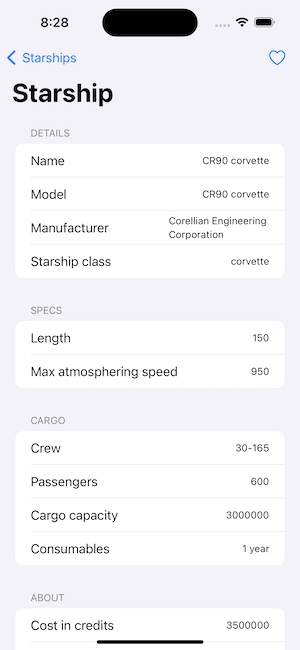

# SwiftUI MVVM Base

This project aims to be a base for MVVM projects made with SwiftUI. It downloads some data from [SWAPI](https://swapi.dev) API and presents it nicely in a SwiftUI list. It also stores some information in CoreData.

***

## Architecture

### Navigation

The navigation is implemented using a coordinator pattern. Each coordinator (in this case only one) contains a `Router` used to power the logic of the `navigationDestination` from [NavigationStack](https://developer.apple.com/documentation/swiftui/navigationstack).

Using a `NavigationDestination` struct 

> Instead of using just an enum for `NavigationDestination`, we need to provide an identifier to the route to be able to save the state of the ViewModel. If we don't store the state, we cannot reuse a view of the same type more than one time. Hence the need to use a struct.

### View Builder

Each view contains a `Builder` that configures the ViewModel with the proper dependencies. This builder is also in charge of storing the state of each ViewModel.

> We use a `NSMapTable` to avoid memory leaking the ViewModels.

### MVVM

The app is using an MVVM architecture pattern where all of the views logic happens inside the views `ViewModel`. This means we can decouple the logic (+ navigation) from the view.

Also using a `Configurator` for each screen allows us to configure and present this view from anywhere in the app.

### Protocol Oriented

The app is built using a protocol oriented approach, meaning that almost all of the properties of the objects can be replaced with mocked types. This means that testing the components is very easy.

For example, to test the `StarshipsRepository` logic, it's very easy to create mocks for `LocalDataSourceProtocol`, `CoreDataManagerProtocol`, `RemoteDataSourceProtocol` and `APIClientProtocol`.

### Repository pattern

I like to use the repository pattern to put all of the API/DB related calls inside, meaning that if you want to do something related with Starships, you'll always use `StarshipsRepository`. This way, if something changes you'll only need to update/change the specific repository and not change anything else from the ViewModel.

#### Network

The requests to API is very straightforward. A generic `APIClient` that makes a request to wherever `Endpoints`. The cool thing is that this APIClient is generic and decodes directly to the Model you asked for.

The endpoints are very easy to use and to extend using `enums`.
